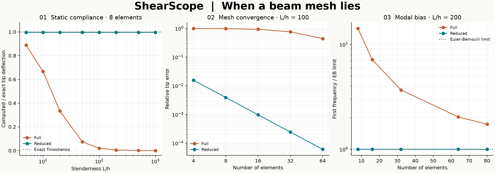

# ShearScope

**When a beam mesh lies:** a C++17/Python laboratory showing how shear locking
corrupts static compliance and natural frequencies. Compare full and selective
reduced integration, reproduce the convergence study, and inspect equilibrium and
energy checks. This is an original educational research implementation, not a
certified structural design tool.



## The experiment

For a one-metre aluminium cantilever with a rectangular section, how much can
quadrature change the answer? The campaign varies slenderness from 5 to 1000 and
mesh size from 4 to 64 elements. It then studies the first three modes of a slender
beam. The C++ element kernel is shared by all experiments; Python handles sparse
assembly, constraints, linear algebra, diagnostics and plotting.

The topics connect AFEM (Timoshenko kinematics, quadrature and locking) with
Structural Dynamics (consistent mass and generalized eigenproblems). No course
materials or private datasets are included. See [provenance](docs/PROVENANCE.md).

## Build and install

Requires Python 3.11+, CMake 3.20+, and a C++17 compiler. Linux: GCC or Clang;
Windows: Visual Studio 2022 Build Tools with **Desktop development with C++**.
Internet access is needed to obtain Python build/runtime dependencies initially.

```bash
python -m venv .venv
# Linux/macOS:
source .venv/bin/activate
# Windows PowerShell instead:
# .venv/Scripts/Activate.ps1
python -m pip install ".[dev]"
shearscope analyze --elements 32 --height 0.01 --force 1
shearscope campaign --output out
python examples/cantilever.py
```

The extension is compiled during installation. Reinstall after changing Python or
C++ source (`python -m pip install --no-deps .`). No runtime compilation is used.
macOS is expected to work but is not part of the current CI matrix.

For the initial Windows/Python 3.14 environment, use the versions recorded in
`requirements-repro.txt`. That file is a platform-specific snapshot, while
`pyproject.toml` defines the supported dependency ranges. Wheels contain a compiled
extension and are specific to the Python version and platform.

## Governing equations and numerical method

Let transverse displacement be $w(x)$, section rotation $\theta(x)$,
curvature $\chi=\theta'$, and shear strain $\gamma=w'-\theta$.
For section width $b$ and height $h$,

$$A=bh,\quad I=bh^3/12,\quad G=E/[2(1+\nu)],\quad S=\kappa GA.$$

The default shear correction is $\kappa=5/6$. The potential energy is

$$\Pi=\tfrac12\int_0^L[EI(\theta')^2+S(w'-\theta)^2]dx
-\int_0^L q w\,dx-Pw(L)-M_t\theta(L).$$

Its variation gives $V=S(w'-\theta)$, $M=EI\theta'$,
$-V'=q$, and $-M'-V=0$. At the root $w=\theta=0$; at the tip
$V=P$ and $M=M_t$. Positive forces follow positive $w$.

Each straight element has linear displacement and rotation and DOF order
$[w_1,\theta_1,w_2,\theta_2]$. For element length $\ell$,

$$B_b=[0,-1/\ell,0,1/\ell],\qquad
B_s=[-1/\ell,-N_1,1/\ell,-N_2],$$
$$K_e=\int_0^\ell(EI B_b^T B_b+S B_s^T B_s)dx.$$

Bending is integrated exactly. Full integration uses two Gauss points for shear;
reduced integration uses its midpoint. Linear interpolation cannot reproduce
zero shear under arbitrary bending everywhere inside an element. The resulting
spurious shear energy makes the full-integration element too stiff as $h/L$
decreases. Midpoint shear integration removes this particular locking mechanism.
This observation concerns this beam element; it does not establish that arbitrary
reduced-integration elements are stable.

The consistent mass integrates translational $\rho A$ and rotary $\rho I$ inertia
exactly, using the two-node $\ell[2,1;1,2]/6$ matrix for each field. Mass is never
reduced-integrated. After sparse COO-to-CSR assembly and root DOF elimination,
static analysis solves $K_{ff}u_f=f_f$. Modal analysis solves
$K_{ff}\phi=\omega^2 M_{ff}\phi$ with a dense symmetric generalized eigensolver.
Frequencies are $\omega/(2\pi)$; eigenvectors satisfy $\Phi^T M\Phi=I$.

## Independent validation

The static benchmark follows integration of the continuum equilibrium equations:

$$w(L)=P\left(\frac{L^3}{3EI}+\frac{L}{S}\right)
+\frac{M_t L^2}{2EI}
+q\left(\frac{L^4}{8EI}+\frac{L^2}{2S}\right).$$

Tests cover tip force, tip moment and uniform distributed loading separately,
global reactions, work/energy balance, rigid motions, matrix symmetry and rank,
positive mass, nonuniform meshes, invalid inputs and second-order convergence.
The element is checked against an independent polynomial-integral matrix.

For dynamics, the first three frequencies are compared to the slender
Euler–Bernoulli limit,
$f_j=\beta_j^2\sqrt{EI/(\rho A)}/(2\pi L^2)$, with roots of
$\cos\beta\cosh\beta=-1$. This is a **limiting comparison**, not an exact
thick-beam Timoshenko solution. Eigenpair residuals and mass orthogonality provide
additional algebraic checks. Validation details and actual results are recorded in
[the validation report](docs/VALIDATION.md).

```bash
ruff check .
ruff format --check .
clang-format --dry-run --Werror cpp/element.hpp cpp/bindings.cpp cpp/test_element.cpp
python -m pytest --cov=shearscope --cov-report=term-missing
cmake -S . -B build/native -DSHEARSCOPE_PYTHON=OFF
cmake --build build/native --config Release
ctest --test-dir build/native -C Release --output-on-failure
python -m build
```

Native CTest checks are active in Release builds (they do not use disabled
`assert` macros). CI runs the checks on Ubuntu and Windows with Python 3.11 and
3.14, and uploads generated figures, data and distribution artifacts.

## Python API

```python
from shearscope import Beam, assemble, exact_tip, solve_static, modes

beam = Beam(length=1.2, width=0.025, height=0.012, young=70e9, poisson=0.3, density=2700)
result = solve_static(
    beam, elements=32, integration="reduced", force=1.0, moment=0.0, distributed=0.0
)
print(result.displacement[-1], exact_tip(beam))
print(result.reactions, result.strain_energy, result.relative_residual)
frequencies_hz, shapes = modes(beam, elements=32, count=3)
x, stiffness, mass = assemble(beam, nodes=[0, 0.2, 0.6, 1.2])
```

All dimensions use SI units: m, Pa, kg/m³, N, N·m, N/m and Hz. Static results
contain nodal displacement/rotation, two root reactions, strain energy, and a
free-DOF residual. Custom node coordinates override `elements` in static/assembly
calls. The low-level `_core.element(length, ei, shear, rho_a, rho_i, reduced)`
returns two 4×4 NumPy arrays. CLI defaults use width 0.02 m, $E=70$ GPa,
$\nu=0.3$, density 2700 kg/m³; use Python for other materials or load families.

## Reproducible outputs and limits

`shearscope campaign --output out` creates `locking.csv` (80 static cases),
`modes.csv` (10 eigensolves × 3 modes), `summary.json`, and `shearscope.png`.
The committed `results/` directory contains the initial run. There is no random
sampling. Floating-point results and image rendering can differ slightly across
platforms; compare numerical tolerances, not binary hashes.

- Uniform, prismatic, straight, isotropic, small-displacement linear beams only.
  No axial force, geometric stiffness, damping, nonlinear material or 3D frames.
- The high-slenderness campaign uses unit-load compliance; absolute deflections
  can violate small-displacement assumptions. Scale force down when interpreting
  an actual physical experiment. Ratios are load-independent in this linear model.
- Dense modal analysis is limited to 500 elements; static assembly to 10,000.
  This project emphasizes verification, not high-performance large-scale solving.
- Extreme slenderness, extreme unit scales or near-coincident nodes can make the
  stiffness ill-conditioned. Residuals alone do not bound solution error.
- Rotary inertia is included but thick-beam modal accuracy is not independently
  validated here. The continuum model itself omits 3D cross-section effects.

## References

- [TU Delft: Timoshenko beam formulation and shear locking](https://teachbooks.tudelft.nl/computational-modelling/structural_linear/timoshenko.html).
- [TU Delft: approaches to avoid Timoshenko shear locking](https://teachbooks.tudelft.nl/computational-modelling/structural_linear/Tutorials/Gridap_timoshenko.html).
- S. P. Timoshenko, D. H. Young and W. Weaver, *Vibration Problems in Engineering*,
  4th ed., Wiley, 1974: classical beam vibration background.

MIT license; see [LICENSE](LICENSE). Contributions: [CONTRIBUTING.md](CONTRIBUTING.md).
